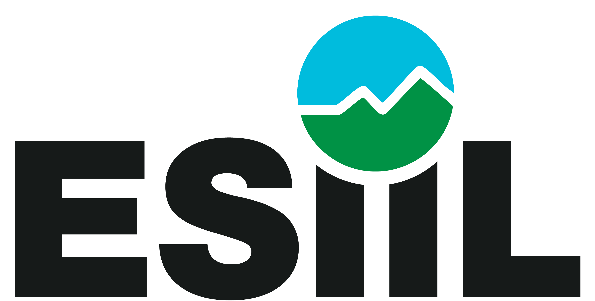

  A working scientific perspective from
  

# FAIR + CARE for Agentic Science

**Agentic AI is a stress test for scientific infrastructure.**

The goal is not to make science easier for AI. It is to use AI as a test of whether we have made science explicit enough to be independently understood, reproduced, evaluated, and governed.

  <a class="md-button md-button--primary" href="https://github.com/CU-ESIIL/FAIR-and-CARE-for-AGENTS/blob/main/manuscript/fair_care_agentic_science_v2.md">Read the working manuscript</a>
  <a class="md-button" href="https://github.com/CU-ESIIL/FAIR-and-CARE-for-AGENTS">Explore the repository</a>

## The context-free collaborator

Human collaborators routinely fill gaps with memory, conversation, and unwritten lab conventions. A newly arriving agent cannot safely be assumed to know which workflow is canonical, why a decision was made, or which data uses are prohibited.

That apparent weakness is useful. When an independent agent fails, the failure may reveal that the scientific object itself is underspecified.

  Find
  Understand
  Execute
  Evaluate
  Modify
  Reproduce
  Govern

## Design the test before delegating the work

Agent-ready science begins by stating what success means, what actions are allowed, and what evidence must be preserved.

  <strong>Goal</strong><small>Define the scientific objective.</small>
  <strong>Test</strong><small>Specify observable criteria.</small>
  <strong>Instructions</strong><small>State methods and boundaries.</small>
  <strong>Execution</strong><small>Work in a known environment.</small>
  <strong>Evaluation</strong><small>Compare results with the test.</small>
  <strong>Provenance</strong><small>Preserve the evidential record.</small>

## From principles to operational questions

### FAIR

**Can an independent actor correctly use this science?**

Make projects findable, accessible, interoperable, and reusable through clear discovery, durable artifacts, executable environments, and reproducible results.

### CARE

**Should this actor be allowed to use it in this way?**

Make collective benefit, authority to control, responsibility, and ethics part of the operational design—not an appendix added after deployment.

### Test-first design

**How will we know whether both conditions are satisfied?**

Translate claims into inspectable evidence, runnable checks where appropriate, and explicit human or community decisions where judgment is essential.

Each principle now has a version-controlled evidence map linking its design criteria to what this repository implements—and naming what is still missing. [Review the FAIR + CARE evidence maps](principles/index.md).

## What this repository contains

This repository is the editable working home for the Perspective. It includes the full manuscript, the project website, operating instructions for agents, and a verbatim prompt log that records consequential requests and the work completed in response.

!!! note "Current status"
    The current manuscript is a concise second draft organized around eight practical FAIR + CARE repository rules. The full first draft remains preserved for its extended argument and TODOs. Both drafts still require Indigenous data sovereignty review and adversarial novelty assessment before journal submission.
