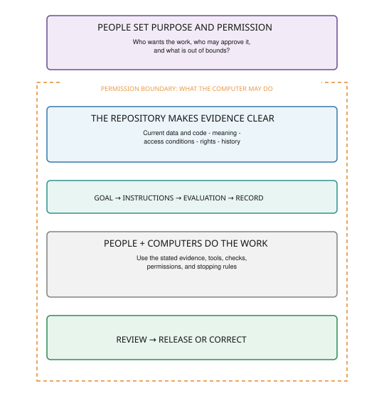

# Before Agents Act: Design Criteria for Reliable and Governable Environmental Science

**Manuscript type:** Perspective  
**Status:** Working draft  
**Canonical source:** This Markdown file  
**Intended journal:** *Ecology*  
**Authors:** Ty Tuff and Naupaka Zimmerman

## Abstract

Environmental scientists increasingly ask coding agents to inspect repositories, change analyses, call services, and prepare research products. Yet a repository rarely contains everything an experienced collaborator knows. It may not say which script is current, why a calibration changed, which observations are sensitive, where data may be sent, or who must approve a release. An agent does not acquire that context, judgment, or authority simply by opening the files. We offer a practical rule for consequential computer-assisted science: specify the work before the computer acts. The specification has four parts—**Goal → Instructions → Evaluation → Record**—and can be implemented with familiar research-computing tools: a task brief, identified inputs, configuration and environment files, access controls, tests, provenance, and a review gate. FAIR-aligned infrastructure helps people and machines find and interpret the research objects involved. A separate governance decision establishes what may be done with them. CARE demonstrates why technically reusable data are not necessarily legitimately reusable; our general governance gate is not CARE and does not assess CARE compliance. The framework scales with consequence and can begin with one important result and one important boundary. Its purpose is simple: make enough scientific context and authority explicit that a person or agent can act correctly, stop safely, and leave a useful record.

**Keywords:** agentic AI; CARE; data governance; environmental science; FAIR; provenance; reproducibility; research software

## 1. A repository is not a collaborator

Imagine giving a new graduate student a project directory and saying, “update Figure 3.” The student can ask which of three similarly named scripts is current, why last year’s sensor threshold changed, and whether the underlying coordinates may appear in a public map. A coding agent can search the directory and run the first plausible workflow before anyone notices that these questions were unanswered.

Here, a **coding agent** is software that can pursue a task by reading and changing files, running code, and using external tools or services. Unlike a conventional script, it may choose its next action as it works. That flexibility is useful, but it also makes missing instructions consequential.

Most environmental science repositories were built for people who already know the project. A colleague may remember that `analysis_final_v2.R` is obsolete, a spreadsheet was edited by hand, or the published figure came from another branch. They may know that records from one site cannot leave institutional infrastructure, that an external service is prohibited, or that a product requires review before release. This knowledge often lives in memory, email, meetings, or relationships with data creators. Research on scientific data reuse shows that documentation and local knowledge strongly affect whether shared data can be understood and reused (Wallis et al., 2013).

An agent does not inherit this working knowledge, scientific judgment, or legitimate authority merely by gaining access to the repository. Software benchmarks show that agents can fail real coding tasks or take unintended actions when instructions and environments are incomplete or adversarial (Jimenez et al., 2024; Ruan et al., 2024; Debenedetti et al., 2024). Environmental research separately documents risks from obsolete or heterogeneous data and from releasing sensitive species locations (Tulloch et al., 2018; Chapman, 2020). The intersection is our inference: when a fast-acting system meets a repository with missing context, an ordinary documentation gap can become a scientific error or an unauthorized disclosure.

Finishing the task is therefore not enough. A polished figure may have been made from the wrong file. A model may run successfully with an invalid calibration. A useful-looking map may reveal locations that should remain restricted. Agent success does not establish scientific validity, and access to data does not establish permission to use or publish them.

Reproducibility asks whether someone can understand and reproduce what happened (Gentleman & Lang, 2007; Peng, 2011; Sandve et al., 2013). Agent-assisted work adds a question that must be answered earlier: **What was the computer allowed to do before it acted?**

FAIR and CARE illuminate different parts of that question. FAIR concerns digital research objects and metadata: whether objects can be identified, accessed under stated conditions, interpreted, and reused (Wilkinson et al., 2016; Barker et al., 2022). CARE was developed by the Global Indigenous Data Alliance to advance Indigenous Peoples’ collective rights, interests, innovation, and self-determination in data (Carroll et al., 2020). CARE makes clear that technical access and technical reuse do not make a use legitimate. This Perspective proposes a separate, general governance gate for agent-assisted environmental work. Where Indigenous Peoples, Indigenous data, Indigenous Knowledges, lands, waters, resources, or rights are involved, that general gate does not replace CARE or the authorities, laws, protocols, and decisions of the relevant People (Carroll et al., 2021; Carroll et al., 2022; Jennings et al., 2023; Taitingfong et al., 2024).

## 2. Four questions before the computer acts

Our contribution is a **pre-delegation specification**: a short description of the science, boundaries, checks, and record required before a person gives an agent permission to act. Its parts are familiar. The useful change is to put them together before execution rather than reconstructing them after something goes wrong.

> **GOAL → INSTRUCTIONS → EVALUATION → RECORD**

**Goal: What are we trying to accomplish?** Name the result, not merely the activity. “Run the model” is vague. “Reproduce the internal habitat-suitability map used in the June review” identifies an output and its use. A good goal also says which claim or decision the result may support, who requested it, and who is supposed to benefit. Put this in a short task file, an issue, or a clearly labeled section of the project documentation.

**Instructions: What should the computer use, and where must it stop?** Identify the authoritative data, code, configuration, and computing environment. State which files may be changed, whether network access is allowed, which services may receive data, and whether the system may create only a draft or also prepare a release. Put stable instructions in version control. Use manifests and configuration files for inputs and parameters, environment or lock files for software versions, and technical controls—such as read-only directories, network restrictions, and limited credentials—for boundaries that should not depend on a prompt.

**Evaluation: How will we recognize success, failure, and a proper refusal?** A workflow needs more than “the command completed.” It might check that input columns and units are correct, a mass balance closes, a known result is reproduced within tolerance, and restricted coordinates never appear in an output. Three kinds of evidence matter. Automatic checks test requirements with predictable answers, such as schemas, hashes, expected values, or blocked network access. Repeatable agent trials ask a named model or service to perform fixed tasks with stated tools and scoring; because agent behavior varies, these trials should record dates and repeated runs. Authorized review covers decisions a test cannot make, including scientific interpretation, acceptable use, and release. Automated evidence can inform that review, but it cannot create legitimate authority (Bahim et al., 2020; Tabassi, 2023; Autio et al., 2024).

**Record: What must remain after the run?** Keep enough information to answer: What ran? Which versions and inputs did it use? What changed? Which checks passed or failed? Did the agent refuse or request help? Who reviewed the result, and what did they decide? Version control provides part of this history, but a useful run record may also include input identifiers or hashes, the environment, the model or service used, material tool actions, outputs, uncertainties, and the review decision. Do not turn provenance into indiscriminate surveillance: credentials, sensitive locations, and governed knowledge should not be copied into general logs.

These four answers do not require a new software platform. A small project might use a one-page task description, an input manifest, a locked environment, a test command, and a short run record. Larger projects may express the same information through workflow systems, access-control services, continuous integration, provenance standards, and formal approvals. The names of the files matter less than whether a new person or system can find and follow them.

## 3. Turn principles into working repository features

Philosophical principles become useful to a computer only when they change what the computer can find, interpret, test, or do. For a research repository, that translation can be straightforward.

- **Make the important objects unmistakable.** Give datasets, software, workflows, and released outputs stable identifiers and versions. Mark the canonical input and current workflow instead of expecting a reader to infer them from filenames.
- **Explain access, including limits.** Say how an authorized user retrieves an object, what authentication is required, and why access may be restricted. A useful record can remain findable even when the data themselves cannot be openly downloaded.
- **Define what the values mean.** Record field names, units, coordinate systems, missing-value rules, vocabularies, and relationships among inputs, code, and outputs. A table called temperature is not interoperable if no one knows whether it contains air or water temperature, daily means or instantaneous readings, or degrees Celsius or Fahrenheit.
- **Make reuse conditions explicit.** State rights, licenses or other terms, provenance, versions, domain standards, and instructions for reuse. If the project claims computational reproducibility, identify the inputs, code, environment, command, and expected result (Wilkinson et al., 2016; Bahim et al., 2020; DataCite Metadata Working Group, 2026; Soiland-Reyes et al., 2022).

These are FAIR-aligned repository practices, not additions to the FAIR principles. FAIR does not require a particular website, `AGENTS.md` file, container, test suite, or prompt log. Those are possible engineering choices for exposing and checking the relevant evidence.

The repository also needs an orientation page for people and tools. It should answer the questions a careful newcomer would ask: What is this project? Where is the current workflow? Which outputs matter? How do I run the smallest safe example? What must I never change, transmit, or publish without asking? Who can answer a scientific question, and who can approve a release? Structured dataset and model documentation offer useful precedents for making intended uses, limits, and provenance visible (Mitchell et al., 2019; Gebru et al., 2021; Bridgeford et al., 2026).

Finally, use computer controls for rules that computers can enforce. If restricted data must not reach the internet, do not rely only on a sentence telling an agent to be careful. Run it in an environment without external network access. If it may edit code but not source data, make the data read-only. If release requires a person, have the workflow produce a draft and stop before publication. These controls can show that a stated rule was followed. They cannot show that the person who wrote the rule had the right to do so.

Before granting access or tools, ask:

1. Who is meant to benefit, and who could carry the cost or risk?
2. Who gave permission, and permission for exactly what? Can the data leave this computer, reach this model or service, be combined with other data, or appear in public?
3. Who is responsible for running, reviewing, approving, and releasing the work? Who can stop it or withdraw an output?
4. What relationships, harms, or obligations mean the work should change or not proceed?

That is the governance gate. It is a human and institutional decision supported by technical evidence, not a box a computer can check. Technical access is not legitimate authority.

## 4. Use more structure when the consequences are greater

Not every computer action needs the same machinery. Asking an agent to reformat a bibliography is different from asking it to change the model behind a published result.

- **Low-consequence work** includes reversible, local formatting, documentation, and exploratory code using unrestricted information. A short instruction, a build check, and version control may be enough.
- **Scientifically consequential work** changes inputs, analysis code, models, figures, or results that support a claim. It needs identified versions, scientific checks, and expert review.
- **Work with governance consequences** uses restricted or sensitive information, sends material to an external service, trains a model, changes what may be disclosed, publishes an artifact, or takes an action that is hard to reverse. It also needs clear authority, enforced boundaries, and a release gate.

These are practical distinctions, not a scoring system. When uncertain, ask what would happen if the computer used the wrong file, produced the wrong result, sent the data to the wrong place, or released the output too early. Controls, evidence, and review should match those consequences.

## 5. A worked example: making a habitat map

Consider a laboratory using public satellite imagery and access-restricted species observations to prepare a habitat map. The example is illustrative; it is not a report of an agent experiment.

**Goal.** Create an internal habitat-suitability map for a named conservation planning meeting. The output is evidence for discussion, not an autonomous management recommendation.

**Instructions.** Use the listed imagery, approved occurrence records, current calibration file, named model, and locked software environment. The occurrence records are read-only and the computing environment has no external network connection. The agent may make a draft map but may not reveal coordinates, replace inputs, change the release resolution, or publish anything.

**Evaluation.** Check the input fields, units, coordinate system, and calibration date automatically. Compare model performance with thresholds chosen before the run. Use synthetic locations to confirm that the output and logs do not reveal restricted coordinates. A qualified scientist reviews the interpretation; an authorized person reviews any proposed release.

**Record.** Save the versions and hashes of the inputs and code, the environment, commands and material tool actions, draft output, test results, refusals, uncertainties, reviewer comments, and final decision.

Now the meaning of success is clearer. If the agent cannot find the current calibration, it should stop and ask rather than choose one. If it tries to send coordinates to an external mapping service, the network control should block the action; that refusal is a successful boundary check. If the model passes its performance threshold but no authorized reviewer has approved release, the map is scientifically promising but not publishable.

FAIR-aligned evidence helps the agent find the correct imagery and observations, interpret their fields and coordinate systems, distinguish versions, and trace the draft map back to its inputs. FAIR alone does not authorize transmission, transformation, inference, or publication. Sensitive-species guidance establishes that location disclosure can create conservation risks (Tulloch et al., 2018; Chapman, 2020); we infer that tool-using agents can encounter those risks when repository boundaries are unclear.

If Indigenous data or Knowledges might be involved, the laboratory does not decide on its own to add them to the workflow. Work begins with the authority and protocols designated by the relevant Indigenous People. The appropriate outcome may be a redesigned workflow, different stewardship, restricted products, or no use (Carroll et al., 2022; Jennings et al., 2023; Taitingfong et al., 2024).

## 6. Start with one result and one boundary

A laboratory does not need to redesign every project at once. Choose one important result and do the following:

1. Point to the authoritative data, code, configuration, and expected output.
2. Write a goal that says what the output is for.
3. Record the versions and the command or workflow used to produce it.
4. Add one scientific check that would catch a believable error.
5. Add one boundary that the computer must not cross, and enforce it where possible.
6. Run the task from a clean start, record what was missing, and revise the instructions.
7. Save the run record and the name or role of the reviewer.

This exercise often reveals ordinary problems before it reveals exotic AI problems: an undocumented manual edit, an unpinned package, an ambiguous filename, a missing unit, or no clear owner for the final decision. Fixing those problems improves the project for every collaborator.

## 7. Limits and evaluation

This is a design proposal, not a validated assurance system. Documentation becomes stale, services change, tests miss cases, and a green check can create false confidence. Records also take labor to create and maintain. Institutions should support laboratories with shared metadata tools, secure computing, evaluation infrastructure, and incident response rather than shifting all work to individual researchers, data stewards, field teams, or communities. Participation by affected communities must be authorized and adequately resourced (David-Chavez & Gavin, 2018; Jennings et al., 2023).

The proposal should be tested on representative environmental tasks. Comparisons could measure scientific correctness, completion, provenance, unauthorized actions, appropriate and false refusals, correction time, and review burden across human-only and agent-assisted workflows. Such studies can test whether the design works. They cannot turn legitimate authority into a universal score.

## 8. Conclusion

Modern research computers can do more than calculate: they can choose files, edit workflows, call services, and prepare material for release. That makes an old problem—missing context—more urgent. Giving an agent a repository does not give it the knowledge or authority of a collaborator. Before consequential work begins, tell the computer what result is wanted, what evidence and boundaries govern the work, how to recognize success or a reason to stop, and what record to leave. Make those directions real through identifiers, manifests, locked environments, tests, access controls, provenance, and human review. Start with one consequential result and one consequential boundary.

## Artificial intelligence transparency statement

OpenAI Codex, a GPT-5-based coding and writing assistant, was used on 29–30 August 2026 to assist with prose revision, LaTeX structure, editable table and figure code, literature discovery, the citation audit and BibTeX database, and compilation checks. It was not used to generate empirical data or conduct statistical analyses. Ty Tuff directed its use and made the editorial and conceptual decisions. The authors retain responsibility for independently verifying the generated material and for the manuscript as a whole. Codex is not an author, and its output does not constitute scientific validation, ethical approval, Indigenous consultation, endorsement, or governing authority.

## Acknowledgments

The authors used OpenAI Codex as described in the Artificial Intelligence Transparency Statement.

## Table 1

**Table 1.** A practical guide for preparing one consequential computer-assisted result. File names and technologies are examples; the required function matters more than the implementation.

| Before the run | Human question | Put it into the computer system | Quick check |
|---|---|---|---|
| Purpose and permission | Who wants this work, who may approve it, and what is outside scope? | Named owner and reviewer; permission scope; data and service limits; stopping and release gate. | Can a reviewer identify who can say yes, no, or stop? |
| FAIR-aligned evidence | Can the needed data, code, and outputs be found and understood? | Stable identifiers and versions; metadata; access conditions; schemas; units; rights; provenance. | Resolve one input and trace it to one output. |
| Goal | What exact result is wanted, and what will it be used for? | A short task brief naming the expected output, purpose, requester, and intended use. | Can a newcomer restate the task without guessing? |
| Instructions | Which inputs, method, tools, and limits apply? | Input manifest; configuration; environment lock; run command; read, write, network, and publication rules. | Start clean and count the oral hints still required. |
| Evaluation | What would count as success, error, proper refusal, or need for review? | Schema and scientific checks; expected values or tolerances; safe boundary test; named reviewer. | Break one test fixture and confirm the workflow stops. |
| Record | What must remain afterward? | Commit; input and code identifiers or hashes; environment; actions; outputs; test results; uncertainties; review decision. | Trace one output back to its inputs and reviewer. |

## Figure captions

**Figure 1.** A practical workflow for consequential computer-assisted science. People establish the purpose and permission. The repository supplies understandable evidence. Goal–Instructions–Evaluation–Record tells the computer what to do, how to stop, and what to preserve. People review the result before release or correction.

## References

- Autio, C., Schwartz, R., Dunietz, J., Jain, S., Stanley, M., Tabassi, E., Hall, P., & Roberts, K. (2024). *Artificial intelligence risk management framework: Generative artificial intelligence profile* (NIST AI 600-1). National Institute of Standards and Technology. https://doi.org/10.6028/NIST.AI.600-1
- Bahim, C., Casorrán-Amilburu, C., Dekkers, M., Herczog, E., Loozen, N., Repanas, K., Russell, K., & Stall, S. (2020). The FAIR data maturity model: An approach to harmonise FAIR assessments. *Data Science Journal, 19*, 41. https://doi.org/10.5334/dsj-2020-041
- Barker, M., Chue Hong, N. P., Katz, D. S., Lamprecht, A.-L., Martinez-Ortiz, C., Psomopoulos, F., Harrow, J., Castro, L. J., Gruenpeter, M., Martinez, P. A., & Honeyman, T. (2022). Introducing the FAIR Principles for research software. *Scientific Data, 9*, 622. https://doi.org/10.1038/s41597-022-01710-x
- Bridgeford, E. W., Campbell, I. D., Chen, Z., Lin, Z., Ritz, H., Vandekerckhove, J., & Poldrack, R. A. (2026). Twelve quick tips for AI-assisted coding in science. *PLOS Computational Biology, 22*(7), e1014428. https://doi.org/10.1371/journal.pcbi.1014428
- Carroll, S. R., Garba, I., Figueroa-Rodríguez, O. L., Holbrook, J., Lovett, R., Materechera, S., Parsons, M., Raseroka, K., Rodriguez-Lonebear, D., Rowe, R., Sara, R., Walker, J. D., Anderson, J., & Hudson, M. (2020). The CARE Principles for Indigenous Data Governance. *Data Science Journal, 19*, 43. https://doi.org/10.5334/dsj-2020-043
- Carroll, S. R., Herczog, E., Hudson, M., Russell, K., & Stall, S. (2021). Operationalizing the CARE and FAIR Principles for Indigenous data futures. *Scientific Data, 8*, 108. https://doi.org/10.1038/s41597-021-00892-0
- Carroll, S. R., Garba, I., Plevel, R., Small-Rodriguez, D., Hiratsuka, V. Y., Hudson, M., & Garrison, N. A. (2022). Using Indigenous standards to implement the CARE Principles: Setting expectations through tribal research codes. *Frontiers in Genetics, 13*, 823309. https://doi.org/10.3389/fgene.2022.823309
- Chapman, A. D. (2020). *Current best practices for generalizing sensitive species occurrence data* (Version 4.7). Global Biodiversity Information Facility Secretariat. https://doi.org/10.15468/doc-5jp4-5g10
- DataCite Metadata Working Group. (2026). *DataCite metadata schema documentation for the publication and citation of research data and other research outputs* (Version 4.7). DataCite e.V. https://doi.org/10.14454/qdd3-ps68
- David-Chavez, D. M., & Gavin, M. C. (2018). A global assessment of Indigenous community engagement in climate research. *Environmental Research Letters, 13*(12), 123005. https://doi.org/10.1088/1748-9326/aaf300
- Debenedetti, E., Zhang, J., Balunović, M., Beurer-Kellner, L., Fischer, M., & Tramèr, F. (2024). AgentDojo: A dynamic environment to evaluate prompt injection attacks and defenses for LLM agents. In *Advances in Neural Information Processing Systems* (Vol. 37). https://doi.org/10.52202/079017-2636
- Gebru, T., Morgenstern, J., Vecchione, B., Vaughan, J. W., Wallach, H., Daumé III, H., & Crawford, K. (2021). Datasheets for datasets. *Communications of the ACM, 64*(12), 86–92. https://doi.org/10.1145/3458723
- Gentleman, R., & Lang, D. T. (2007). Statistical analyses and reproducible research. *Journal of Computational and Graphical Statistics, 16*(1), 1–23. https://doi.org/10.1198/106186007X178663
- Jennings, L., Anderson, T., Martinez, A., Sterling, R., Chavez, D. D., Garba, I., Hudson, M., Garrison, N. A., & Carroll, S. R. (2023). Applying the CARE Principles for Indigenous Data Governance to ecology and biodiversity research. *Nature Ecology & Evolution, 7*, 1547–1551. https://doi.org/10.1038/s41559-023-02161-2
- Jimenez, C. E., Yang, J., Wettig, A., Yao, S., Pei, K., Press, O., & Narasimhan, K. R. (2024). SWE-bench: Can language models resolve real-world GitHub issues? In *Proceedings of the Twelfth International Conference on Learning Representations*. https://openreview.net/forum?id=VTF8yNQM66
- Mitchell, M., Wu, S., Zaldivar, A., Barnes, P., Vasserman, L., Hutchinson, B., Spitzer, E., Raji, I. D., & Gebru, T. (2019). Model cards for model reporting. In *Proceedings of the Conference on Fairness, Accountability, and Transparency* (pp. 220–229). Association for Computing Machinery. https://doi.org/10.1145/3287560.3287596
- Peng, R. D. (2011). Reproducible research in computational science. *Science, 334*(6060), 1226–1227. https://doi.org/10.1126/science.1213847
- Ruan, Y., Dong, H., Wang, A., Pitis, S., Zhou, Y., Ba, J., Dubois, Y., Maddison, C. J., & Hashimoto, T. (2024). Identifying the risks of LM agents with an LM-emulated sandbox. In *Proceedings of the Twelfth International Conference on Learning Representations*. https://openreview.net/forum?id=GEcwtMk1uA
- Sandve, G. K., Nekrutenko, A., Taylor, J., & Hovig, E. (2013). Ten simple rules for reproducible computational research. *PLOS Computational Biology, 9*(10), e1003285. https://doi.org/10.1371/journal.pcbi.1003285
- Soiland-Reyes, S., Sefton, P., Crosas, M., Castro, L. J., Coppens, F., Fernández, J. M., Garijo, D., et al. (2022). Packaging research artefacts with RO-Crate. *Data Science, 5*(2), 97–138. https://doi.org/10.3233/DS-210053
- Tabassi, E. (2023). *Artificial intelligence risk management framework (AI RMF 1.0)* (NIST AI 100-1). National Institute of Standards and Technology. https://doi.org/10.6028/NIST.AI.100-1
- Taitingfong, R., Martinez, A., Hudson, M., Lovett, R., Maher, B., Prehn, J., Rowe, R. K., Boileau, K., Franks, A., Khan, S., Walker, J. D., & Carroll, S. R. (2024). Aligning policy and practice to implement CARE with FAIR through Indigenous Peoples’ protocols. *Acta Borealia, 41*(2), 80–90. https://doi.org/10.1080/08003831.2024.2410112
- Tulloch, A. I. T., Auerbach, N., Avery-Gomm, S., Bayraktarov, E., Butt, N., Dickman, C. R., Ehmke, G., et al. (2018). A decision tree for assessing the risks and benefits of publishing biodiversity data. *Nature Ecology & Evolution, 2*(8), 1209–1217. https://doi.org/10.1038/s41559-018-0608-1
- Wallis, J. C., Rolando, E., & Borgman, C. L. (2013). If we share data, will anyone use them? Data sharing and reuse in the long tail of science and technology. *PLOS ONE, 8*(7), e67332. https://doi.org/10.1371/journal.pone.0067332
- Wilkinson, M. D., Dumontier, M., Aalbersberg, I. J., et al. (2016). The FAIR Guiding Principles for scientific data management and stewardship. *Scientific Data, 3*, 160018. https://doi.org/10.1038/sdata.2016.18
